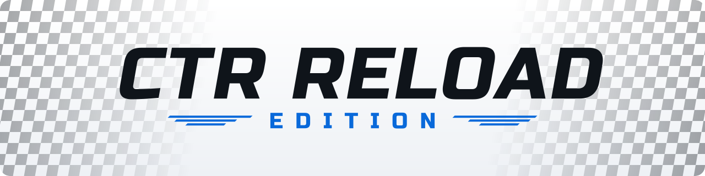

  <picture>
    <source media="(prefers-color-scheme: dark)" srcset="docs/assets/banner-dark.svg">
    <source media="(prefers-color-scheme: light)" srcset="docs/assets/banner-light.svg">
    
  </picture>

  <b>A PC edition of Crash Team Racing built for custom content — custom tracks and custom characters. 
  Built on <a href="https://github.com/CTR-tools/ctr-native">ctr-native</a>.</b>

  <!-- releases/latest is the newest full release; the nightly build is a pre-release and never "latest". -->
  
   
  Want the newest state? The <a href="https://github.com/LinksTech/CTR-Reload-Edition/releases/tag/nightly-builds">nightly build</a> is made from main every night - untested, no guarantees.

  
  
  
  

  <a href="#features">Features</a> &middot;
  <a href="#getting-started">Getting started</a> &middot;
  <a href="#custom-tracks">Custom tracks</a> &middot;
  <a href="#custom-characters">Custom characters</a> &middot;
  <a href="#whats-next">What's next</a> &middot;
  <a href="#building-from-source">Building</a> &middot;
  <a href="#reporting-bugs">Bugs</a> &middot;
  <a href="#credits">Credits</a> &middot;
  <a href="#always-up-to-date">Up to date</a> &middot;
  <a href="#license-and-disclaimer">License</a>

CTR Reload Edition runs *Crash Team Racing* (PS1, 1999) natively on Windows,
without an emulator, and plays custom tracks and custom characters next to
the original ones.

> [!IMPORTANT]
> You need **your own disc image** of the game, NTSC-U (SCUS-94426), as
> `.cue`/`.bin`. This repository and its releases contain **no game data**: no
> disc image, no extracted files, no models, textures, music or tracks. Apart
> from the bundled SDL library, they hold no 3D models, voices, sound effects
> or images made by other people either.

> [!WARNING]
> This is a **beta** for testing. Expect bugs - and please
> [report them](#reporting-bugs).

## Features

### 🎨 Graphics
- New Vulkan renderer
- Internal resolution up to 8x, MSAA anti-aliasing
- Real widescreen: 4:3, 16:9 and 21:9 — the view gets wider, nothing
  is stretched
- Menus stay nicely centered on ultrawide screens
- OPTIONS → GRAPHICS: display mode, aspect ratio, resolution and
  anti-aliasing, saved for the next start

### 🏁 Custom tracks — our main focus
- Drop a .rldtrack file into the tracks folder and it shows up in game
- New NITRO-PIT mode under Arcade with everything for custom tracks:
  - **Race**, with bots on tracks that have nav paths
  - **Time Trial** with your best times per track and lap count
  - **Custom cups** of four tracks each
  - **Crystal Challenge**: collect every crystal before the time runs out
  - **CTR Challenge**: finish 1st and collect C, T and R
- A track is listed under every mode it has the data for
- A preview video of each track plays in the track selection
- Tracks bring their own music and their own minimap, scaled
  automatically for the track screen
- Fixes for crashes found in community tracks, and broken track data
  gets caught before you race, not mid-race

### 🧑‍🚀 Custom characters
- Build your own driver from a PLY or OBJ model (OBJ with its MTL and
  PNG/JPG/TGA/BMP textures), exported at any scale
- The model is fitted to Crash's size, repaired and, above the triangle
  limit, reduced automatically - the shape and the colours stay
- Your own icon in the driver select and the race HUD, mask (Aku Aku or
  Uka Uka), minimap colour and voice clips
- The driving style (Balanced, Acceleration, Speed, Turning) decides how
  the kart drives and sounds
- Kart wheels drawn or hidden, for models that bring their own vehicle
- Drop a .rldchar file into the characters folder and it gets its own tile
  in the driver select - up to 32 of them

### 🛠️ Reload Studio
- One window for tracks, cups and characters — no command line, no
  scripts, no patching
- Checks while you work and says in plain words what is wrong and how to
  fix it
- "Build container" also records the track's preview in the background
- Character preview next to Crash and in the steering poses, the way the
  game will draw it
- Notices a new export by itself and checks again; long builds show their
  progress and can be cancelled
- "Test in game" starts a race on your track straight away
- Dark and light mode, follows the Windows display scale

### ⚙️ Under the hood
- Custom memory budget: big custom tracks get extra room (up to 32 MB),
  and buffers are sized per track. Original tracks keep their original
  tables, with larger draw and clip buffers
- New VRAM handling: palette textures go through a GPU atlas instead of
  being decoded from emulated PS1 VRAM for every pixel — groundwork for
  higher-res textures later
- Less emulation where it doesn't matter: several PS1 rendering steps
  now run natively, like transparency in a single pass
- Runs out of room gracefully: an effect is left out and logged instead
  of a crash

### ✨ Quality of life
- First-start window: just drag in your disc image
- Settings are remembered, faster boot
- Race pauses when you alt-tab or minimize
- New main menu with Options (cheats, scrapbook) and Exit
- All characters unlocked from the start — your save stays untouched
- F12 saves a screenshot; F11 or Alt+Enter toggles full screen
- A log with date and time for every start, the last five are kept
- Folder and user names with any characters work (accents, Cyrillic ...)

## Getting started

1. Download **`ctr_native.exe`** (the game) and **`ReloadStudio.exe`** (the
   track and character tool) from the [latest release](https://github.com/LinksTech/CTR-Reload-Edition/releases/latest)
   into one folder you can write to, for example `C:\Games\CTR Reload` (not
   `C:\Program Files`).
2. Start `ctr_native.exe` and drag your disc image (`.cue` or `.bin`) onto the
   window. The game unpacks what it needs into an `assets` folder next to it,
   once (about 520 MB).
3. Set up the picture in OPTIONS → GRAPHICS.
4. Create a folder `tracks` next to the game and put `.rldtrack` files into it.
5. Race them: ARCADE → NITRO-PIT → RACE, CUP, CRYSTAL or CTR. Under RACE, the
   MODE box below the laps offers TIME TRIAL.
6. For custom characters, create a folder `characters` next to the game and
   put `.rldchar` files into it. They show up in the one-player ARCADE driver
   select, after the original drivers.

The game reads both folders when it starts: after a new track or character,
restart the game.

Windows 10 (1903 or newer) or Windows 11 and a graphics driver with Vulkan 1.0.

## Custom tracks

Reload Studio (`ReloadStudio.exe`) builds a track container from your exported
track folder (`.lev`, `.vrm` and optional music), checks it and records its
preview. On its Cups page you put up to four cups together, and "Test in game"
starts a race on your track straight away. Keep it next to `ctr_native.exe`.

What a track needs for each mode

| Mode | Needs |
| --- | --- |
| Race | restart points (the checkpoints that count the laps); bots also need nav paths |
| Crystal Challenge | at least one crystal |
| CTR Challenge | each of the letters C, T and R exactly once |
| Time Trial | the same as Race; chosen in the MODE box below the laps |
| Battle | not available yet |

At most 110 placed objects (crates, fruit, letters and every other placed
model); above 90 Reload Studio warns.

## Custom characters

On its Character page, Reload Studio builds a `.rldchar` driver from one PLY
or OBJ model of driver, steering wheel and kart, in five steps: model,
driver, in-game look, voices and extras. The model can be exported at any
scale - it is fitted to Crash with his kart, repaired (split corners, holes,
faces turned inward) and, if it has more triangles than a driver may draw,
reduced until it fits. The preview shows it next to Crash and in the
steering poses, the way the game will draw it.

You choose the driving style (Balanced, Acceleration, Speed, Turning), the
mask, an icon for the driver select and the race HUD, a minimap colour and a
folder of voice clips. Switch off "Show kart wheels" for a model that brings
its own wheels or vehicle.

Current limits

- Only in the one-player ARCADE driver select and the NITRO-PIT time trial;
  not in NITRO-PIT CRYSTAL or CTR, Adventure, Battle or with two players
- At most 32 characters get a tile; their own icon shows for the first 20
- The size is visual only - physics and collision follow the driving style
- The cup podium, high score lists and profiles still show Fake Crash
- A driver without voice clips is silent

Every page and message of Reload Studio is explained in section 4 of the
[Reload Studio guide](tools/package/README.txt); what is new in each version
is in the [release notes](tools/package/RELEASE-NOTES.txt).

## What's next

Planned, in no particular order and without a date:

- Battle on custom tracks
- Boss races and race modifiers in NITRO-PIT
- Custom characters in more modes: two players, Adventure and the NITRO-PIT
  challenges
- Wheels and animations of your own for custom characters - Reload Studio
  shows them as "Coming soon" cards; `ReloadStudio.exe
  --enable-preview-features` unlocks their unfinished preview, which writes
  nothing into the character file
- Skin support for the drivers
- ...and more

We build continuously; a new version comes out when enough has come together.
Until then, fixes and additions land here first.

## Building from source

Visual Studio 2022, CMake, the Vulkan SDK and Python.

Steps and developer notes

From a command prompt in the repository root:

    build-msvc.bat

This builds the Release configuration in `build-msvc-x86\` and runs the
self-tests. Requirements, results, tests and packaging are described in
[BUILDING.md](BUILDING.md).

Quick states and replays exist only behind the developer switch `--dev`. They
are raw memory snapshots of the game: load only files you made yourself.

`--dev --deterministic` is the measuring mode of the reference runs. VSync
emits only the VBlanks the game asks for and never catches up by wall clock,
and audio is rendered per VBlank. Only the script drives the game
(`--menu-keys`, `--level`, `--autoload-demo`, `--autopilot`, a replay):
keyboard, mouse, pads and window focus do not reach it. Losing focus or
minimising never pauses, a display change keeps the aspect, and the debug
keys, F11, Alt+Enter, Ctrl+Q and the name-entry keys do nothing; closing the
window still ends the run. The log names this once at start, and at exit
one line per kind counts what was kept away, only when something was (pad
triggers and sticks are kept away but not counted). Without `--deterministic` nothing
changes. Reload Studio records a track preview this way too. The window size
still reaches the renderer: with `--res-scale native` the picture, and so a
`--shot`, depends on the size of the window.

## Reporting bugs

Open an [issue](https://github.com/LinksTech/CTR-Reload-Edition/issues) with
the bug report template, one issue per problem.

What to include - and what never to attach

- The version: `ctr_native.exe --version`
- What happened, what you expected, and the steps to get there
- The newest log from the `logs` folder next to the game
- For a custom track or character: its file name and the SHA-256 Reload
  Studio shows

Issues are public: never attach disc images, the `assets` folder, memory cards,
`.rldtrack`/`.rldchar` files or other game data, and edit your Windows user
name out of the log if you mind.

## How this project is made

- Built on human-written foundations: ctr-native and the CTR-ModSDK
  decompilation.
- CTR Reload Edition is developed by two people. We write code ourselves and
  together with Claude Code (Anthropic), decide what gets built, review every
  change and test it - with measured reference runs, automated checks and
  hands-on play testing.
- Development happens openly, in batches and without fixed dates; how to
  contribute is described in [CONTRIBUTING.md](CONTRIBUTING.md).

## Credits

- [ctr-native](https://github.com/CTR-tools/ctr-native): the native PC port
  this edition is based on
- [CTR-ModSDK](https://github.com/CTR-tools/CTR-ModSDK): the decompilation
  project that ctr-native and this edition are built on
- **Sunset Vista by Tramadoll**: the track and its extras are his work. This
  repository only contains a compatibility layer (`game/native_trackmod.c`) so
  that the track runs natively in CTR Reload. The track itself is not included.
  Sunset Vista compatibility data used with permission of Tramadoll.

Other components (PsyCross, SDL3 and more), the banner font and their licenses
are listed in [THIRD_PARTY_NOTICES.md](THIRD_PARTY_NOTICES.md).

## Always up to date

This repository is kept up to date with the help of Claude Code
(Anthropic): the README, the guide in the package, the release notes and the
automatic builds are brought in line with the code as the project grows, so
what you read here matches what the newest version does. Every change is
reviewed by us before it lands.

## License and disclaimer

CTR Reload Edition is licensed under the
[GNU General Public License v3.0](LICENSE).

This is a non-commercial fan project. It is not affiliated with, endorsed by or
sponsored by Activision, Naughty Dog, Sony Interactive Entertainment or any
other rights holder. *Crash Team Racing* and *Crash Bandicoot* are trademarks
of their respective owners.
